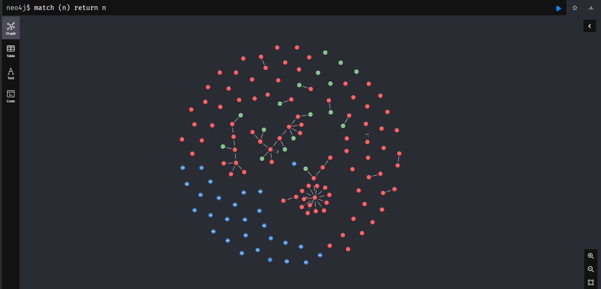

# SysmonNeo4j
Open Source Tool - Sysmon Neo4j Visualizer.

# **Prerequisites**
Follow steps 1 - 4  to run SysmonNeo4j.py

### **1) Download and Install Neo4j Desktop**
   - Windows Users: https://neo4j.com/download/
     
     Create an account to get the license (totally free), download and install Neo4j Desktop.
     
     Useful Video: https://tinyurl.com/yjjbn8jx
     Useful Video: https://tinyurl.com/vvpjf3dr
     
### **2) Create and Configure the Database**
   - Create Database: DBMS version must be 5.0+
     - Windows Users:
       
       You can create databases in whatever version you want (latest version preferable) through GUI or Neo4j Terminal.
       - Create a new database in GUI: Just click the (+), set DB Name, Username and Password. Useful Tutorial: https://www.sqlshack.com/getting-started-with-the-neo4j-graph-database/
       - Through Neo4j Shell: https://neo4j.com/docs/cypher-manual/current/databases/
   - Configure Database:
       - By default, ```SysmonNeo4j.py``` will use the arguments below (if not explicitly provided in the CLI):
       ```
     --url:"bolt://localhost:7687"
     --username:"neo4j"
     --password:"password"
     ```
   So make sure to use these values while creating the DBMS for the default values to work.

       - Install APOC Plugin:
         - Windows Users: In Neo4j Desktop Main Page --> Choose your Database --> Click Plugins --> APOC --> Install
   
       - Configure Database Apoc Settings File:
         - Windows Users: On the DBMS click on the three dots then select Open folder --> DBMS.
            - navigate to the "conf" folder.
            - Create a file named "apoc.conf" and insert following lines to it:
           ```
           apoc.export.file.enabled=true
           apoc.import.file.enabled=true
           ```
           Restart DBMS and reload it.
       
### **3) Install requirements.txt**
   - SysmonNeo4j Uses: evtx, neo4j

    virtualenv venv 
    .\venv\Scripts\activate
    pip install -r requirements.txt 
        

# **Run SysmonNeo4j**
Default Command:
```
python SysmonNeo4j.py -f SYSMONSAMPLE -s STARTTIME -e ENDTIME -u BOLT_URL -n USERNAME -p PASSWORD
```
Shortened Command:
- The command below will upload the entire ```.evtx``` file to the DBMS,
    using the default values mentioned above for the arguments:

    ```-u\--url```,```-n\--username``` and ```-p\--password```
```
python SysmonNeo4j.py -f SYSMONSAMPLE
```
Example Command, using the provided sysmon recordings for demonstration:
```
.\SysmonNeo4j.py -s 2022-11-22-20:30:05 -e 2022-11-22-20:30:35 -f .\evtx_samples\firstsample.evtx -p password -u neo4j 
.\SysmonNeo4j.py -s 2022-12-25-08:00:00 -e 2022-12-25-15:20:00 -f .\evtx_samples\secondsample.evtx -p password -u neo4j
``` 
Default Run Example in Ubuntu
``` 
sudo python3 SysmonNeo4j.py -f SYSMONSAMPLE -s STARTTIME -e ENDTIME -u BOLT_URL -n USERNAME -p PASSWORD 
``` 
# **Run time and memory usage**
- While it is possible to load entire .evtx samples into the neo4j DB using ```python SysmonNeo4j.py -f SYSMONSAMPLE```,
we recommend using the ```-s STARTTIME``` and ```-e ENDTIME``` arguments to upload a selected timerange to Neo4j. 
    
    Make sure to filter your events using the ```SystemTime``` attribute.


- If you still wish to load entire samples to the database, we recommend modifying the DBMS's memory and heap capacities, 
using the following lines in the ```neo4j.conf``` file (can be found under ```Settings...```, or in the ```conf``` folder of your DBMS.):
```
dbms.memory.heap.initial_size=512m
dbms.memory.heap.max_size=1G
dbms.memory.pagecache.size=512m
// Modify these values according to your preferences and system resources.
```

# **General user experience and preferences in Neo4j Browser**
- In order to show a large amount of nodes (default is 300), run this command in your Neo4j shell:

```
:config initialNodeDisplay: x
// x representing the amount of nodes to be shown. 
```
Note that this WILL be resource intensive, and thus slower.

- By clicking a node, a data menu will open in the left corner of the graph, presenting the node's description and values.

    in said menu, you can customize the visual output to your liking;

    selecting a node type's color, as well as choosing the value to be shown for each node type in the graph.

- For a dracula theme, run this command in your Neo4j shell:

```
:config theme: "dark"
```

# **SysmonNeo4j.py:**



